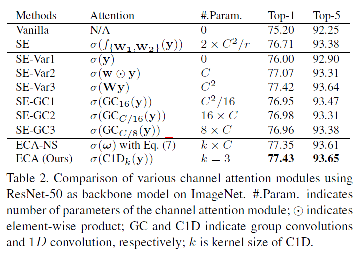
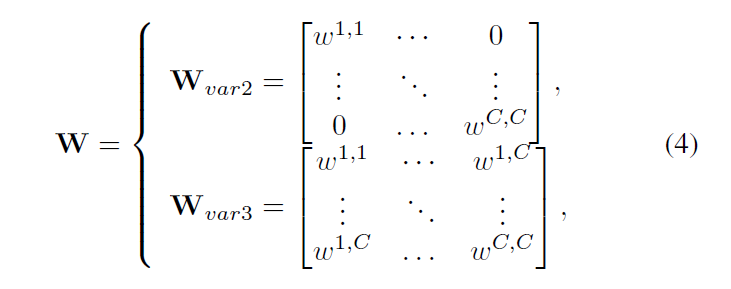

# Abstract

注意力模块增加计算负担

提出一种轻量级ECA模块

通过回顾SENet，证明了避免降维和适当的跨通道交互对于学习有效的通道注意力是重要的。

## Contributions

* 实验表明，避免降维和适当的跨通道交互对于学习有效的深度CNNs通道注意是重要的。
* 我们提出了一种新型的高效通道注意(ECA)，尝试为深度CNNs开发一种非常轻量级的通道注意模块，该模块增加的模型复杂度很小，但带来了明显的改进
* 在ImageNet-1K和MS COCO上的实验结果表明，我们的方法比最先进的方法具有更低的模型复杂性，同时获得了非常有竞争力的性能。

# Method

## 回顾SE Block中的Channel Attention 

$X\in R^{W\times H\times C}$

channel的权重计算如下
$$
\omega=\sigma(f_{\{W_1,W_2\}}(g(X)))
$$
其中$g(X)=\frac{1}{WH}\sum_{i=1,j=1}^{W,H}X_{ij}$是逐个通道的global average pooling，$\sigma$是Sigmoid函数

### 避免降维

如前所述，等式2的降维使得通道与其权重之间的对应是间接的。为了验证它的效果，我们将原始的SE块与它的三个变体进行了比较，这三个变体都没有进行降维。从表1可以看出，没有参数的SE-Var1仍然优于原网络，说明通道注意有能力提高深度CNNs的性能。同时SE- var2独立学习每个通道的权值，在参数较少的情况下略优于SE块。这可能表明，通道及其权值需要直接对应，而避免降维比考虑非线性通道相关性更重要。此外，使用单个FC层的SE- var3在降维的SE块中比两个FC层的性能更好。以上结果清楚地说明了在注意模块中避免降维的重要性。因此，我们开发的ECA模块没有降低通道维数。

### 局部通道交互

给定聚合特征$y\in R^C$，通道注意力可以由$\omega=\sigma(Wy)$学到

SE-Var2和SE-Var3的区别在于W，前者是对角矩阵，后者是全参数对称矩阵，参数量分别为C和C x C

SE-Var3结果忧郁SE-Var2，表明**跨通道交互对学习通道注意力是有好处的**，但参数量太多

一个可行的折衷是把$W_{var2}$变为一个块对角矩阵，相当于把通道分为了G个组，局部捕捉跨通道信息

式5可视为深度可分离卷积

但是，如表1所示，不同分组的SE-GC并没有带来超过SE-Var2的增益，这说明分组卷积并不是一种有效的跨通道交互利用方案。同时，过多的组卷积会增加内存访问成本。

本文用一个band matrix来学习通道注意力

与上述方法不同，我们的目标是捕获局部的跨通道交互，即只考虑每个通道与其k近邻之间的相互作用。因此，$y_i$的权重可以计算为

其中$\Omega_i^k$表示$y_i$的k近邻通道集合

一个更有效的方法是使所有通道共享学习参数

这可以用一维的卷积核为k的卷积快速实现

此方法称为ECA，表1中的使用k=3

### 局部跨通道交互覆盖范围

在我们的ECA模块(等式6)中，内核大小k是一个关键参数。由于使用1D卷积来捕获局部的跨通道交互，k决定了交互的覆盖范围，不同的通道数和不同的CNN架构的卷积块可能会有所不同。尽管k可以手动调优，但它将消耗大量计算资源。k与通道维数c有关，这是合理的。一般认为，通道尺寸越大，长期交互作用越强，而通道尺寸越小，短期交互作用越强。换句话说,之间可能存在某种映射$\phi(k)$和C:

在这里,最优配方的映射$\phi$通常是未知的。然而，基于上述分析，k与C成非线性比例，因此参数化指数函数是一个可行的选择。同时，在经典的核技巧中，作为核函数的指数族函数(如高斯)被广泛用于处理未知映射问题。因此,我们使用一个指数函数近似此映射

此外，由于通道维C通常设置为2的整数次幂，所以我们用2作为底数

$|t|_{odd}$为离t最近的记述

## ECA模块用于Deep CNN

# 实验

分类和检测

ImageNet， COCO。

Faster R-CNN (Ren et al. 2017)和Mask R-CNN (He et al. 2017)

## 基于ImageNet-1K的大规模图像分类

在这里，我们首先访问了内核大小对ECA模块的影响以及自适应内核大小选择的有效性，然后使用ResNet-50、ResNet-101、ResNet-152和MobileNetV2与最先进的同类模型和CNN模型进行比较。

## 核大小的影响和自适应核大小的选择

如等式6所示，我们的ECA模块涉及一个参数k，即一维卷积的核大小。在这一部分，我们评估了它对ECA模块的影响，并验证了所提出的内核大小自适应选择的有效性。为此，我们采用ResNet-50和ResNet-101作为骨干模型，并通过我们的ECA模块对它们进行训练，设置k为3到9。结果如图4所示，从中我们得到了以下观察结果。

首先，当k在所有卷积块中固定时，ECA模块分别在ResNet-50和ResNet-101的k = 9和k = 5处得到最佳结果。由于ResNet-101有更多的中间层，这些中间层控制着ResNet-101的性能，所以它可能更喜欢小内核大小。此外，这些结果表明，不同深度的CNNs具有不同的最佳k值，k对ECA-Net的性能有明显的影响。其次，我们的自适应核大小选择试图为每个卷积块找到最优的k个数，这样可以缓解深度CNNs的深度影响，避免参数k的手动调整，而且通常会带来进一步的改善，证明了自适应核大小选择的有效性。最后，不同k值的ECA模块的学习效果始终优于SE块，说明避免降维和局部跨通道交互确实对学习通道注意产生了积极的影响。

**比较使用ResNet-50** 接下来，我们将ECA模块与几种使用ResNet-50在ImageNet上的最先进的注意力方法进行比较，包括SENet (Hu, Shen，和Sun, 2018)、CBAM (Woo等，2018)、A2-Nets (Chen等，2018)、AA-Net (Bello等，2019)和gsopi - net1 (Gao等，2019)。评估指标同时涉及效率(即、网络参数、每秒浮点运算次数(FLOPs)、训练/推理速度和效率(即(/前5的准确性)。为了公平的比较，我们复制了所有比较方法的结果，除了训练/推理速度。为了测试各种模型的训练/推理速度，我们使用公共可用的模型来比较CNNs，并在相同的计算平台上运行它们。结果如表2所示，我们可以看到我们的ECA-Net具有几乎相同的模型复杂度(即与原ResNet-50相比，提高了2.28%，在精度上达到了Top-1。与最先进的同类产品(即、SENet、CBAM、A2 - net、AA-Net和gsopi - net1)， ECA-Net获得更好的或有竞争力的性能，同时受益于更低的模型复杂性。

**比较使用ResNet-101** 使用ResNet-101作为骨干模型，我们将我们的ECA-Net与SENet (Hu, Shen, and Sun 2018)、CBAM (Woo等人2018)和AA-Net (Bello等人2019)进行比较。从表2中我们可以看出，ECA-Net的准确率在前1名的基础上比原来的ResNet-101高1.8%，模型复杂度几乎相同。在ResNet-50上有相同的趋势，ECA-Net优于SENet和CBAM，而与模型复杂度较低的AA-Net具有很强的竞争力。

**比较使用ResNet-152** 使用ResNet-101作为骨干模型，我们将我们的ECA-Net与SENet (Hu, Shen，和Sun 2018)进行比较。从表2可以看出，ECA-Net在模型复杂度几乎相同的情况下，将原来的ResNet-152的Top-1准确率提高了约1.3%，而在模型复杂度较低的情况下，将SENet的Top-1准确率提高了0.5%。关于ResNet 50、ResNet-101和ResNet-152的结果证明了ECA模块在广泛使用的ResNet体系结构上的有效性。

**比较实用MobileNetV2** 除了ResNet架构，我们还验证了ECA模块在轻量级CNN架构上的有效性。为此，我们采用MobileNetV2 (Sandler et al. 2018)作为骨干模型，并将ECA模块与SE block进行比较。具体来说，我们在MobileNetV2的每个“瓶颈”中都有剩余连接之前，将SE块和ECA模块集成在卷积层中，并将SE块的参数r设为8。所有的模型都使用完全相同的设置进行训练。表2中的结果显示，我们的ECA-Net分别将原来的MobileNetV2和SENet的准确度提高了0.9%和0.14%，分别排在前1位。此外，与SENet相比，我们的ECA-Net具有更小的模型尺寸和更快的训练/推理速度。以上结果再次证明了ECA模块在深度CNNs中的有效性和高效性。

**比较其他的CNN模型** 在这一部分的最后，我们将我们的ECA-Net与其他最先进的CNN模型进行比较，包括ResNet-152 (He et al. 2016a)、SENet-152 (Hu, Shen, and Sun 2018)、ResNet-200 (He et al. 2016b)、ResNeXt (Xie et al. 2017)和DenseNet264 (Huang et al. 2017)。这些CNN模型具有更深入、更广泛的架构，其结果均来自于原始论文。如表3所示，我们的ECA-Net50与ResNet-152相当，而ECA-Net101的性能优于SENet-152和ResNet-200，说明我们的ECA-Net可以大大降低计算成本，提高深度CNNs的性能。同时，我们的ECA-Net101与ResNeXt-101相比有很强的竞争力，而ResNeXt-101使用了更多的卷积滤波器和昂贵的组卷积。另外，ECA-Net50可以与DenseNet-264相媲美，但是它的模型复杂度较低。以上结果显示，我们的ECA-Net较先进的CNNs表现良好，同时大大降低了模型的复杂性。值得注意的是，我们的ECA也有很大的潜力来进一步提高CNN模型的性能。

## MS COCO目标检测

在本小节中，我们使用Faster R-CNN (Ren等，2017)和Mask R-CNN (He等，2017)对我们的ECA-Net进行目标检测任务评估。在这里，我们比较我们的ECA-Net与原来的ResNet和SENet。所有的CNN模型首先在ImageNet上进行预训练，然后通过微调转移到MS COCO。

**比较使用Faster R-CNN** 使用Faster R-CNN作为基本的检测器，我们使用50层和101层的ResNets和FPN (Lin et al. 2017)作为骨干模型。如表4所示，无论是集成SE块还是我们的ECA模块，都可以显著提高对象检测的性能。同时，在使用ResNet-50和ResNet-101时，ECA的AP分别比SE block高0.3%和0.7%。此外，我们的ECA模块比SE模块具有更低的模型复杂度。值得一提的是，我们的ECA模块为小对象实现了更多的增益，这些小对象通常很难被检测到。

**比较使用 Mask R-CNN** 我们进一步利用Mask R-CNN来验证我们的eca网络在目标检测任务上的有效性。如表4所示，在50层和101层设置下，ECA模块的AP分别比原始ResNet高1.8%和1.9%。同时，ECA模块使用ResNet-50和ResNet-101分别比SE模块提高了0.3%和0.6%。表4的结果表明，我们的ECA模块可以很好地推广到对象检测，更适合小对象的检测。

## MS COCO的实例分割

最后，我们给出了实例分割的结果，我们的ECA模块使用Mask R-CNN在MS COCO上。与表5相比，ECA模块在模型复杂度较低的情况下，在性能优于SE块的同时，比原来的ResNet有了显著的提高。这些结果验证了ECA模块对各种任务具有良好的泛化能力。

# 结论

本文针对模型复杂度较低的深度CNNs，重点研究其学习通道注意问题。为此，我们提出了一种新的有效通道注意(ECA)模块，该模块通过快速一维卷积产生通道注意，其核大小可由通道维数的函数自适应确定。实验结果表明，我们的ECA是一个非常轻量级的即插即用模块，可以提高各种深度CNN架构的性能，包括广泛使用的ResNets和轻量级的MobileNetV2。此外，我们的ECA-Net在目标检测和实例分割任务中具有良好的泛化能力。未来，我们将在更多的CNN架构中采用ECA模块(如ResNeXt和Inception (Szegedy et al. 2016))，并进一步研究ECA与空间注意模块之间的交互作用。

# 附录A1。卷积激活的全局平均池的可视化

在这里，我们可视化了卷积激活的全局平均池化的结果，这些卷积激活被输入到用于学习通道权重的注意模块。具体来说，我们首先在ImageNet的训练集上训练ECA-Net50。然后，我们从ImageNet验证集中随机选择一些图像。给定一个选中的图像，我们首先通过ECANet50获得它，然后计算来自不同卷积层的激活的全局平均池化。选中的图像见图6的左侧和我们想象的全局平均池化激活值计算从conv 2 3, conv 3 2, conv 3 4, conv 4 3 conv 4 6和conv 5 3 2 3表示的差距,差距3 2 3 4的差距,差距4 3,分别差距4 5 6和差距3。这里，conv23表示第2阶段的第3个卷积层。如图6所示，我们可以观察到不同的图像在同一个卷积层中有相似的趋势，而这些趋势通常表现出一定的局部周期性。其中一些是用红色矩形框表示的。这一现象可能意味着我们可以以一种局部的方式来捕获通道的相互作用。

# 附录A2。通过ECA模块和SE模块学习权重的可视化

为了进一步分析ECA模块对学习通道注意力的影响，我们将ECA模块学习到的权重可视化，并与SE模块进行比较。这里，我们使用ResNet-50作为骨干模型，并举例说明不同卷积块的权值。具体来说，我们从ImageNet中随机抽取了四类，分别是锤头鲨、救护车、药箱和冬南瓜。图5显示了一些示例图像。对网络进行训练后，对从ImageNet验证中收集到的每个类的所有图像，平均计算卷积块的通道权值。图7显示了conv i j的通道权值，其中i表示第i个阶段，j表示第i个阶段的第j个卷积块。除了4个随机采样类的可视化结果外，我们还给出了1K类的平均权值分布作为参考。ECA模块和SE块学习的通道权值分别显示在每行的底部和顶部。

从图7中可以看到以下结果。首先，对于ECA模块和SE块，不同类的通道权值在较早的层(即，从conv 21到conv 3 4)，这可能是由于较早的层目标是捕捉基本元素(如边界和角落)(Zeiler和Fergus 2014)。对于不同的类，这些特性几乎是相似的。这种现象在(Hu, Shen, and Sun 2018)4的扩展版本中也有描述。其次，对于SE块学习到的不同类的通道权值，它们大多趋于相同(即在conv 4 2∼conv 4 5中，不同的类之间的差异不是很明显。相反，ECA模块学习到的权重在不同的通道和课程中明显不同。由于第4阶段的卷积块更倾向于学习语义信息，所以ECA模块学习的权值可以更好的区分不同的类。最后，卷积在最后一个阶段(即。3)捕获高级语义特征，它们更具有类特异性。显然，ECA模块学习的权重比SE模块学习的权重更具有类特异性。以上结果清楚地表明，我们ECA模块学习到的权值具有更好的识别能力。